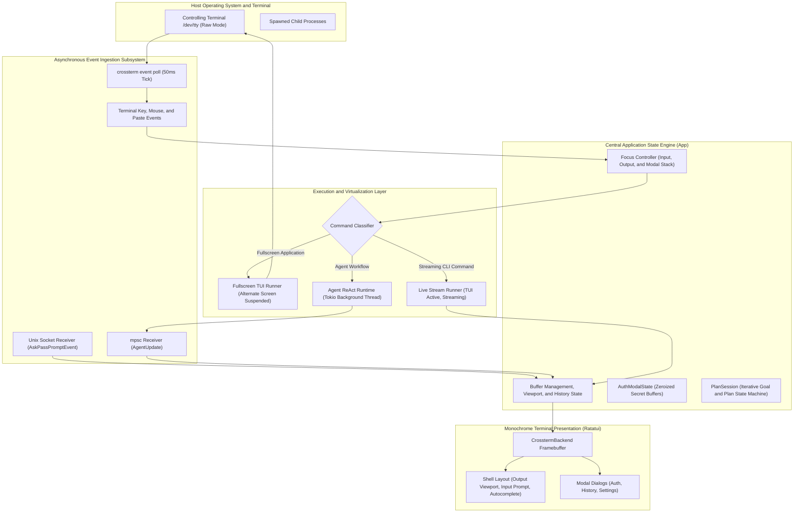
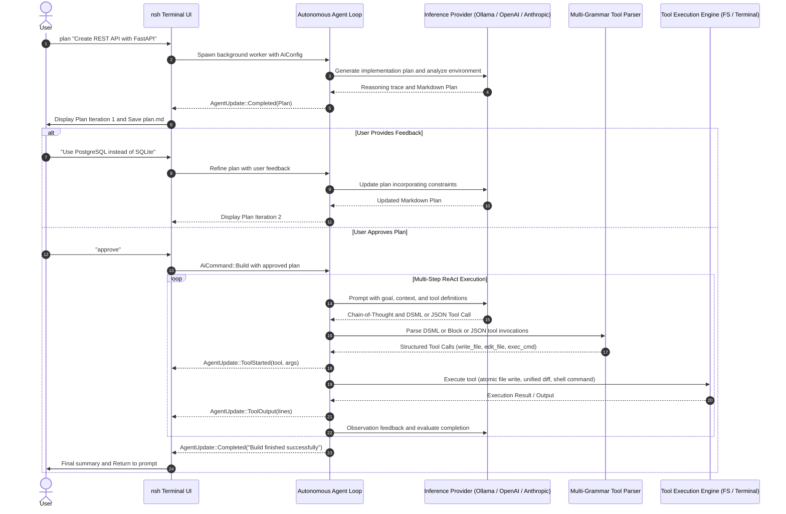
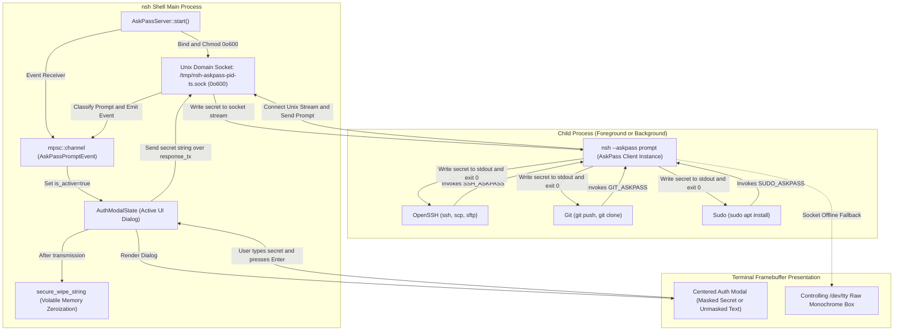
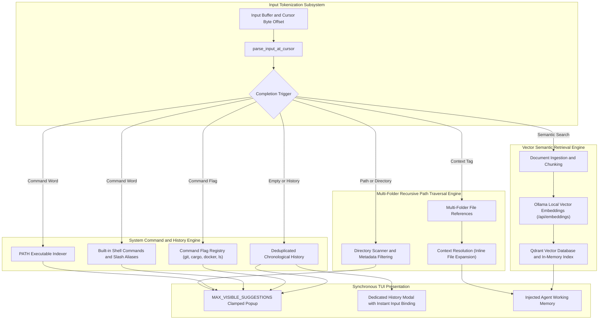

# nsh — The Agentic Unix Shell & Autonomous Systems Runtime

`nsh` is a deterministic, high-performance terminal shell and autonomous systems runtime written in Rust. Designed as an ergonomic replacement for conventional POSIX shells (such as `bash` or `zsh`), `nsh` combines low-latency terminal emulation, an asynchronous event-driven TUI, surgical local filesystem tool execution, an isolated AskPass IPC credential engine, and an embedded ReAct agent execution loop with DeepSeek DSML tool calling.

Operating entirely within the terminal via `ratatui` and `crossterm`, `nsh` preserves native terminal workflows without web views or background daemon overhead, executing direct command streams and multi-step autonomous workflows natively on Linux.

---

## Architectural Pillars

- **Zero-Debounce Terminal Virtualization**: Direct PTY/TTY stream processing with character-by-character carriage return (`\r`) handling, ANSI escape code filtering, and non-blocking background output threads.
- **Dual-Mode Process Scheduler**: Intelligent process classification separating fullscreen interactive TUIs (`nvim`, `htop`, `tmux`, interactive SSH) from streaming terminal commands (`cargo build`, `git push`, `npm dev`, batch remote executions).
- **Universal AskPass IPC Engine**: Isolated Unix domain socket credential broker (`0o600`) mediating authentication requests (`SSH_ASKPASS`, `GIT_ASKPASS`, `SUDO_ASKPASS`) with in-memory volatile zeroization.
- **Autonomous Multi-Grammar ReAct Runtime**: DeepSeek DSML, structured JSON, XML, and block-format tool parser powering multi-step plan-and-build automation with human-in-the-loop validation.
- **Deterministic Context Traversal**: Multi-folder recursive `@` file resolution, contextual command-line autocomplete, and local semantic retrieval via vector embeddings.

---

## System Architecture & Reactive Runtime

`nsh` is structured as a non-blocking, event-driven reactive state machine. The main thread coordinates keyboard and mouse interactions, Unix domain socket IPC events, and agent worker updates on a unified 50ms polling cycle with zero busy-waiting.



---

## Process Scheduling & Terminal Streaming

Standard terminal wrappers frequently suffer from visual stutter, buffering lag, or corrupted display output when external processes output rapid carriage returns (e.g. package managers, progress spinners, compiler progress bars). `nsh` implements a custom stream ingestion pipeline to guarantee immediate visual feedback without terminal state corruption.

```mermaid
flowchart LR
    subgraph InputParser["Command Parsing and Normalization"]
        RawInput["Raw Shell Input"] --> Cleaner["clean_interactive_input"]
        Cleaner --> Tokenizer["POSIX Tokenizer (Quotes and Escapes)"]
    end

    subgraph SchedulingRouter["Process Scheduling Router"]
        Tokenizer --> Dispatcher{"Check Fullscreen TUI"}
    end

    subgraph FullscreenBranch["Interactive TUI Mode"]
        Dispatcher -->|Interactive Application| SuspendTUI["Leave Alternate Screen and Disable Raw Mode"]
        SuspendTUI --> ExecForeground["execute_interactive_command (Inherited stdio)"]
        ExecForeground --> ResumeTUI["Resume Raw Mode and Enter Alternate Screen"]
    end

    subgraph StreamingBranch["Live Streaming UI Mode"]
        Dispatcher -->|Streaming CLI Command| SpawnPiped["std::process::Command (Piped stdout/stderr)"]
        SpawnPiped --> InjectAskPass["inject_askpass_env (SSH/GIT/SUDO_ASKPASS)"]
        InjectAskPass --> ThreadIO["Background Reader Threads (Non-blocking Chunks)"]
        ThreadIO --> ANSIPass["strip_ansi_escapes (Retain Colors and Structure)"]
        ANSIPass --> CarriageReturnEngine["append_live_output (In-Place Line Overwrite)"]
        CarriageReturnEngine --> LiveRender["render() to Terminal Framebuffer"]
    end
```



### Stream Pipeline Characteristics
- **Carriage Return (`\r`) In-Place Rewriting**: When an executable updates progress via `\r`, `App::append_live_output` strips or overwrites the current line buffer in place, preventing multi-line terminal explosion while maintaining an accurate scrollable backlog.
- **ANSI SGR Code Filtering**: SGR color codes (16-color, 256-color, RGB truecolor) and cursor movements are safely normalized and stripped of destructive sequences (e.g., full screen resets) before storing in the session history.
- **Deadlock-Free Pipe Draining**: Processes emitting massive bursts of data (such as verbose builds or `find /`) drain across concurrent background threads, avoiding Linux pipe buffer stalls (64KB default capacity).

---

## Autonomous Agent Runtime & ReAct Planning Engine

`nsh` embeds an autonomous agent execution runtime capable of multi-step problem solving, file inspection, surgical codebase modifications, and shell command execution. The engine supports a two-phase planning and execution protocol with interactive human approval.



### Tool Invocation Parser Architecture
To guarantee model interoperability across frontier and open-weight models, `parse_tool_calls` implements a resilient, multi-format parser supporting:
1. **DeepSeek DSML Format**: `<｜DSML｜invoke name="..."> <｜DSML｜parameter name="..."> ... </｜DSML｜invoke>` (handling both standard ASCII `|` and fullwidth Unicode `｜` delimiters).
2. **Standard JSON Object & Action Blocks**: `TOOL: <name>\nARGS: {...}` and `{"action": "<tool>", "action_input": {...}}`.
3. **Structured Block Format**:
   ```
   TOOL: edit_file
   PATH: src/main.rs
   START_LINE: 10
   END_LINE: 15
   REPLACEMENT:
   pub fn new() -> Self { ... }
   ```
4. **Balanced JSON Extraction**: Robust recovery of unescaped internal quotes and raw multiline string blocks.

---

## Universal AskPass IPC Security Engine

Running administrative commands (`sudo`), connecting to remote hosts (`ssh`), managing Git remotes (`git push`), or decrypting private keys often causes standard terminal wrappers to block indefinitely because standard input is piped. `nsh` implements a dedicated IPC AskPass broker that intercepts credential requests at the system level and routes them into a clean, monochrome in-TUI modal dialog.



### Security & Protocol Guarantees
- **Unix Domain Socket Isolation**: Sockets are bound to `/tmp/nsh-askpass-{pid}-{ts}.sock` and restricted strictly to owner permissions (`0o600`). Non-owner processes cannot read or write to the channel.
- **Volatile Memory Zeroization**: Authentication buffers in both client and server are scrubbed using volatile memory overwrites (`secure_wipe_string`) immediately upon transmission or cancellation, preventing secret retention in process memory.
- **Intelligent Prompt Classification**:
  - `SshPassword`: `user@vps's password:` (masked with `••••`).
  - `SshKeyPassphrase`: `Enter passphrase for key '...'` (masked).
  - `DevicePin`: `Enter PIN for authenticator:` (masked).
  - `HostVerification`: `Are you sure you want to continue connecting (yes/no)?` (**unmasked plain text** with dedicated `Continue (yes/no):` prompt label).
  - `GitCredentials`: HTTP/HTTPS username (unmasked) and token/password (masked).
  - `SudoPassword`: Elevated root access password prompt with cached verification.
- **Agent Interception**: When an autonomous agent (`do` or `build`) issues a command requiring authentication, the command does not hang. The modal prompts the user directly, dispatches the verified credential, and continues the task autonomously.
- **TTY Fallback**: If OpenSSH invokes the askpass client outside an active socket listener, it falls back to a raw monochrome modal rendered directly on `/dev/tty`.

---

## Context Resolution, Autocomplete & Semantic RAG

`nsh` incorporates a context engine capable of real-time input tokenization, recursive path traversal, and semantic vector lookups.



### Chronological History Modal
Typing `history` or `/history` opens an interactive centered modal:
- **Chronological Sequencing**: Older commands at the top, latest executed commands at the bottom.
- **Real-Time Input Synchronization**: Navigating with `Up`/`Down` arrow keys updates `app.current_input` synchronously in real time.
- **Substring Filtering**: Immediate substring matching as characters are typed into the modal search bar.

---

## Command Reference & Built-ins

```bash
# Standard POSIX Execution & Built-ins
nsh: ~$ cd /var/log
nsh: ~$ ls -la
nsh: ~$ history                 # Opens chronological history modal
nsh: ~$ clear                   # Wipes visual screen buffer and scroll backlog
nsh: ~$ help                    # Displays system manual and keybindings

# Remote Streaming vs Fullscreen Execution
nsh: ~$ ssh user@remote-vps     # Fullscreen interactive remote shell (TUI suspended)
nsh: ~$ ssh user@vps uptime     # Streaming remote command (runs live in nsh UI)
nsh: ~$ scp archive.tar vps:/tmp # File copy with in-TUI progress and credentials

# Autonomous Agent Operations
nsh: ~$ ask "Which system service consumed the most CPU in the last hour?"
nsh: ~$ do "Find all unused dependencies in Cargo.toml and remove them"
nsh: ~$ plan "Architect an event-driven microservice in Rust with axum and tokio"
nsh: ~$ build "Implement the approved plan.md specification"

# Configuration & Subsystem Control
nsh: ~$ settings                # Opens interactive full-screen AI configuration TUI
nsh: ~$ index ./docs            # Ingests folder into local vector embeddings
```

---

## Keyboard Navigation & Line Editing

`nsh` adheres to standard GNU Readline and Emacs-style terminal keybindings:

| Shortcut | Description | Subsystem / Scope |
| :--- | :--- | :--- |
| `Tab` | Autocomplete path, command, flag, or `@` context reference | Input Line |
| `Up` / `Down` | Navigate command history or active suggestion popup | Input Line |
| `Enter` | Submit command line / confirm selection | Input Line / Modal |
| `Ctrl+A` / `Home` | Move cursor to start of line | Input Line / Modal |
| `Ctrl+E` / `End` | Move cursor to end of line | Input Line / Modal |
| `Ctrl+W` | Delete word preceding cursor (kill ring storage) | Input Line / Modal |
| `Ctrl+U` | Delete entire line or input buffer | Input Line / Modal |
| `Ctrl+K` | Delete from cursor to end of line | Input Line |
| `Ctrl+Y` | Yank (paste) contents of internal kill ring | Input Line |
| `Ctrl+Left` / `Alt+Left` | Move backward one word boundary | Input Line / Modal |
| `Ctrl+Right` / `Alt+Right`| Move forward one word boundary | Input Line / Modal |
| `PageUp` / `PageDown` | Scroll terminal output backlog | Output Viewport |
| `Ctrl+Shift+C` | Copy active selection or input to system clipboard | Global |
| `Ctrl+Shift+V` | Bracketed paste from system clipboard | Global / Modal |
| `Ctrl+,` | Open full-screen Settings Modal | Global |
| `Esc` | Cancel prompt, close active modal, or stop running process | Global / Modal |
| `Ctrl+C` | Send SIGINT / abort current command or agent step | Global |

---

## Configuration

Session parameters and provider configurations are persisted in `~/.config/nsh/config.json`:

```json
{
  "ai": {
    "provider": "OpenAI",
    "model": "gpt-4o",
    "base_url": "https://api.openai.com/v1",
    "api_key": "sk-...",
    "enabled": true
  },
  "rag": {
    "embed_model": "nomic-embed-text",
    "collection_name": "nsh-knowledge"
  },
  "sudo_prompt_mode": "Auto"
}
```

### Supported AI Inference Providers
| Provider | Default Endpoint | Supported Features |
| :--- | :--- | :--- |
| **Ollama** | `http://localhost:11434` | Local inference, dynamic model discovery, local embeddings |
| **OpenAI** | `https://api.openai.com/v1` | GPT-4o, o1, o3-mini, structured tool calling |
| **Anthropic** | `https://api.anthropic.com` | Claude 3.5 Sonnet, Claude 3.7 Sonnet, extended thinking |
| **Gemini** | `https://generativelanguage.googleapis.com/v1beta/openai/` | Gemini 2.0 Flash, Gemini 1.5 Pro |
| **OpenRouter** | `https://openrouter.ai/api/v1` | Multi-model routing (DeepSeek-R1, Qwen 2.5, Llama 3.3) |
| **OpenAI Compatible** | User defined | vLLM, SGLang, llama.cpp, LocalAI |

---

## Verification & Test Suite

The codebase enforces strict test verification across all modules, verifying POSIX compatibility, ANSI parsing, tool calling formats, memory wipe security, and end-to-end scenarios.

```bash
# Run entire automated test suite (126 tests)
cargo test

# Run integration scenario test suite
cargo test --test scenarios -- --nocapture
```

### Test Suite Summary
- **Unit Tests (`src/lib.rs`)**: 88 passed, 0 failed.
  - POSIX tokenization, metacharacter validation, and quote balancing.
  - ANSI control code stripping and `\r` carriage return stream rewriting.
  - Prompt classification (`SshPassword`, `SshKeyPassphrase`, `DevicePin`, `HostVerification`, `GitCredentials`, `SudoPassword`).
  - AskPass Unix domain socket IPC client-server round-trips and cancellations.
  - Volatile memory zeroization (`secure_wipe_string`).
  - DeepSeek DSML tool parsing across ASCII and fullwidth Unicode pipes.
- **Integration Scenarios (`tests/scenarios.rs`)**: 38 passed, 0 failed.
  - Filesystem CRUD and surgical `edit_file` line/patch operations.
  - Multi-iteration plan and build agent state machines.
  - Universal authentication and AskPass IPC round-trips.
  - Chronological history modal navigation and live input binding.
  - Installed release binary execution and smoke tests.
- **Codebase Hygiene**: Pure monochrome terminal UI styling with verified **zero emojis** across all source and test files.

---

## Build & Installation

### Prerequisites
- Rust 1.80+ (2024 edition compatible)
- Cargo build toolchain
- Linux environment (glibc / musl, x86_64 or aarch64)

### Building from Source

```bash
# Clone the repository
git clone https://github.com/Basharkhan7776/nsh.git
cd nsh

# Compile optimized release binary
cargo build --release

# Install globally into ~/.cargo/bin
cargo install --path . --force
```

### Setting as Default Shell (Optional)

```bash
# Register nsh in system shells
which nsh | sudo tee -a /etc/shells

# Change user shell
chsh -s $(which nsh)
```

---

## License

`nsh` is distributed under the MIT License.
