# nsh Architecture

**nsh** (agentic shell) is a terminal-native Linux shell with a ratatui TUI, Unix-style command execution, and an LLM agent layer (ask / do / plan / build) that can call filesystem and web tools plus optional RAG.

This document is a snapshot of the **current** codebase (not the README roadmap). crate `nsh` `0.1.0`, Rust edition `2024`. Binary and library share `src/`.

**Mermaid diagrams** (GitHub / VS Code / most Markdown previews render them):

- HLD: [process](#12-process-model), [layers](#13-layered-architecture), [AI sequence](#19-runtime-data-flow-ai-verb)
- LLD: [call graph](#5-call-graph-who-uses-what)
- Full set in [§8](#8-detailed-mermaid-diagrams): context, modules, event loop, command router, two execution paths, completions, ReAct, tool parser/dispatcher, RAG, settings states, `App` class, keys, render, providers, threads, disk, startup, errors

---

## 1. High-Level Design (HLD)

### 1.1 Purpose

Give the user a familiar interactive shell (history, completions, `cd`, spawn external programs) **plus** first-class AI verbs that can reason, search, and mutate files without leaving the TUI.

### 1.2 Process model

The binary is **sync** at the UI layer. Async work (LLM, embeddings, HTTP search) is `tokio::runtime::Runtime::new().block_on(...)` either on the main thread (settings model fetch, `/index`) or on a spawned OS thread (AI verbs) so the spinner can keep painting.

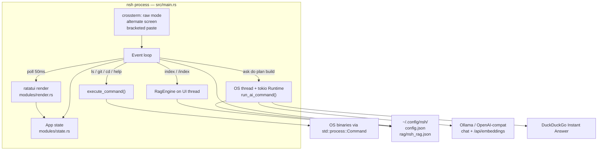

### 1.3 Layered architecture

| Layer | Crate path | Responsibility |
|-------|------------|----------------|
| **Presentation** | `src/main.rs`, `modules/render.rs`, `modules/keybindings.rs` | Terminal lifecycle, input, settings UI, shell paint |
| **Application state** | `modules/state.rs` | History, input buffer, settings stack, AI loading |
| **Shell runtime** | `modules/commands.rs`, `modules/completions.rs` | Built-ins, process spawn, tab complete |
| **Agent** | `ai/agent.rs` | ReAct loop: prompt → parse `TOOL:`/`ARGS:` → tools → answer |
| **LLM adapter** | `ai/mod.rs`, `ai/config.rs` | Provider enum, keys, `aisdk` OpenAI-compatible chat |
| **Tools** | `tools/*` | Structured FS + web_search for the agent (not the user shell) |
| **RAG** | `rag/mod.rs` | Embed via Ollama, index/search documents |
| **Persistence** | `storage/local.rs`, `storage/vector.rs` | JSON config + in-process cosine vector file |

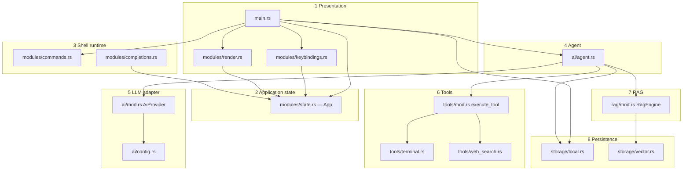

### 1.4 Two execution paths (important)

User-typed Unix commands and agent tools are **not the same code**:

1. **Human shell path** — `execute_command` uses `std::process::Command` (real `ls`, `git`, …) plus a few builtins (`cd`, `clear`, `help`, `settings`).
2. **Agent tool path** — `tools::execute_tool` runs in-process Rust (`cat`, `ls`, `grep`, `write_file`, …) and DuckDuckGo. The model never gets a free-form shell; it only gets named tools.

### 1.5 AI command semantics

| Verb | Max ReAct steps | Intent |
|------|-----------------|--------|
| `ask` / `/ask` | 1 | Q&A; at most one tool call |
| `plan` / `/plan` | 2 | Numbered plan; read-only tools preferred |
| `do` / `/do` | 3 | Small FS tasks (write/copy/move/delete/mkdir) |
| `build` / `/build` | 6 | Explore then write files |

`index` / `/index` is **not** an `AiCommand`; it walks files and calls `RagEngine::index_document` (max 50 files, non-recursive except the immediate directory).

### 1.6 Providers

All chat goes through `aisdk::providers::OpenAICompatible` with a base URL + API key. Provider type only changes:

- default URL
- whether a key is required (Ollama: no)
- env-var fallbacks
- model list (`/api/tags` for Ollama; hardcoded lists otherwise)

Embeddings always hit `{embed_base}/api/embeddings` (Ollama-style), even if chat is a cloud provider. Non-Ollama chat still defaults embed base to `http://localhost:11434`.

### 1.7 Persistence layout

```
~/.config/nsh/
  config.json          # NshConfig { ai, rag }
  rag/nsh_rag.json     # VectorStore points (vectors + payloads)
```

`qdrant-client` is a Cargo dependency but **not used**. `VectorStore` is a JSON file + cosine similarity in memory.

### 1.8 External dependencies (role)

| Crate | Use |
|-------|-----|
| `crossterm` | Raw mode, events, mouse, paste, alternate screen |
| `ratatui` | TUI widgets / layout |
| `arboard` | System clipboard + Linux primary selection |
| `aisdk` | LLM request (`LanguageModelRequest` + OpenAI-compatible provider) |
| `tokio` | Async runtime for HTTP / embeddings / agent |
| `reqwest` | Ollama tags/embeddings, DuckDuckGo |
| `serde` / `serde_json` | Config, tool JSON, vector persist |
| `dirs` | OS config directory |
| `regex` | Agent `grep` |
| `urlencoding` | Search query |
| `thiserror` / `log` / `async-trait` | Errors; `log`/`async-trait` unused in src today |
| `qdrant-client` | Declared; unused in src |

### 1.9 Runtime data flow (AI verb)

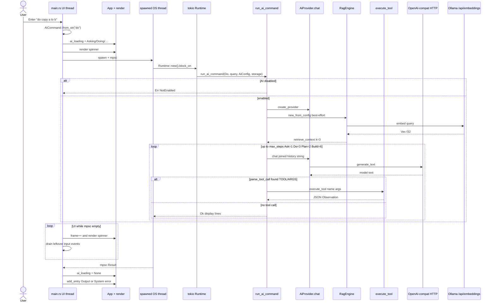

---

## 2. Low-Level Design (LLD)

### 2.1 Crate layout

```
nsh/
├── Cargo.toml / Cargo.lock
├── README.md
├── architect.md          # this file
├── todo.md               # scratch notes (untracked)
├── src/
│   ├── main.rs           # binary: event loop
│   ├── lib.rs            # crate root + re-exports
│   ├── ai/
│   ├── modules/          # TUI / shell
│   ├── rag/
│   ├── storage/
│   └── tools/
└── target/               # cargo build artifacts (not source)
```

`[lib] name = "nsh"` + `[[bin]] name = "nsh"`: the binary `use nsh::{...}` against the library.

### 2.2 Event loop (`main.rs`)

1. `enable_raw_mode`, `EnterAlternateScreen`, `EnableBracketedPaste`.
2. **No mouse capture** in shell mode (so the emulator can drag-select). Capture is toggled **on** only while `app.show_settings`.
3. Each tick: `render` → `poll(50ms)` → handle Key / Paste / Mouse.
4. Alt keys: many terminals send `Esc` then a key. `resolve_key_with_alt_meta` peeks 25ms and ORs `ALT`.
5. Shell keys map through `get_action` → either custom match in `main` (Execute, history, complete, settings, interrupt, EOF) or `execute_action` (editing / clipboard).
6. Settings keys are handled separately (`handle_settings_input`) and do **not** use `Action`.
7. On exit: disable mouse, disable raw, `DisableBracketedPaste`, `LeaveAlternateScreen`.

**Sentinel outputs from `execute_command`:**

- `"__SETTINGS__"` → open settings (same as `Ctrl+,`)
- `"__CLEAR__"` → `app.clear()`

AI verbs are intercepted **before** `execute_command` so they never hit the stub branch in `commands.rs` in the live binary.

### 2.3 `App` state machine

```
entries: Vec<Entry>          # Command | Output | System
current_input + cursor_position
scroll_offset / total_lines  # total_lines updated from wrapped rows in render
suggestions + selected + scroll
history_index + saved_input  # Up/Down through Command entries
kill_ring                    # Ctrl+W / Ctrl+U / Ctrl+K → Ctrl+Y
show_settings + settings_nav stack + SettingsState
ai_loading: Option<AiLoadingState>
```

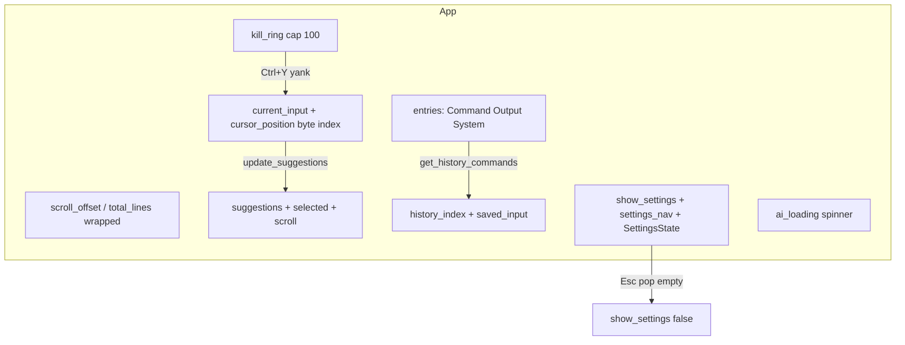

Settings navigation is a stack (`Vec<SettingsPage>`). Empty stack + `show_settings` means Home. Esc pops; empty stack closes settings.

Home fields (cursor index): Provider, Model, BaseUrl, ApiKey, Enable, Save, Cancel.

Save writes `~/.config/nsh/config.json` via `LocalStorage`. Cancel / Esc on Home discard in-memory edits (not auto-saved).

### 2.4 Input editing (LLD)

- Cursor is a **byte** index; `prev_char_boundary` / `next_char_boundary` keep UTF-8 valid.
- Word ops are whitespace-delimited (`word_start_backward` / `word_start_forward`).
- Kill ring: insert at front, cap 100. Yank pastes first entry (not a rotating ring).
- Copy (`Ctrl+Shift+C`): if input non-empty, copy word around cursor (or whole line if cursor at end); if empty, last `EntryType::Output` joined by `\n`.
- Paste: `Event::Paste` (bracketed) preferred; also arboard + Linux primary selection.

### 2.5 Completions (LLD)

`PATH_COMMANDS`: lazy unique basenames of files in `$PATH` dirs (not execute-bit filtered).

`update_suggestions`:

- empty input → hide
- `cd ` prefix → directories under parsed path (`parse_dir_path`)
- else: builtin AI/slash names, then PATH prefix match, then history commands (cap ~20)

Tab: if list already shown, insert selected; else compute; if exactly one, auto-insert.

### 2.6 Command execution (LLD)

`execute_command`:

- `cd` → `std::env::set_current_dir` (process-global cwd for later commands)
- `clear` / `settings` / `help` / `exit` builtins
- AI names in this module return a routing stub string (normally unused because `main` intercepts)
- else `Command::new(program).args(args).output()` — **no pipes, no redirection, no job control, no glob expansion**
- `ls`/`dir`/`eza`/… without a format flag get `-1` prepended so the TUI gets one name per line
- `normalize_output_lines` splits `\r`/`\n` and tab-separated columns

### 2.7 Agent loop (LLD)

`run_ai_command`:

1. Fail if `!ai_config.enabled`.
2. `create_provider` — fails `MissingApiKey` if provider requires key and resolved key length `< 8`.
3. RAG init best-effort; `retrieve_context` concatenates up to 3 docs (hard stop after index 2).
4. History vector of strings (not chat-role API): System prompt, tools JSON, RAG, `cwd`, User.
5. Each step: `provider.chat(vec![history.join("\n\n")])` — **entire transcript as one prompt string**.
6. `parse_tool_call`:
   - `TOOL: name` + `ARGS: {json}` (first line, or remaining as JSON)
   - or a JSON object with `name`/`arguments` or `tool`/`args`
7. Tool result appended as `Observation (tool=…): …`. Errors become `{"error": …}` JSON, not loop abort.
8. If all steps used without a non-tool reply, a fallback English sentence is shown.

`AiProvider::chat` joins messages with `\n` and calls `generate_text()`. No streaming, no native tool-calling API.

### 2.8 Tools (LLD)

Dispatcher `execute_tool(name, args)`:

| Name | Implementation | Notes |
|------|----------------|-------|
| `web_search` | DuckDuckGo Instant Answer JSON | Abstract + up to 5 related topics |
| `cat` | `read_to_string` | UTF-8 files only |
| `ls` | `read_dir` | dirs first, then name sort |
| `grep` | regex; files or dirs | dir: max depth 3, text-ish extensions only |
| `write_file` | create parents + write | overwrite |
| `delete_path` | file or `remove_dir_all` | **recursive, no trash** |
| `copy_path` / `move_path` | recursive copy / rename | |
| `mkdir` | `create_dir_all` | |

No sandbox, no path allowlist, no confirmation. Agent tools operate on the real filesystem relative to process cwd.

`index_directory_simple` (main.rs): **non-recursive** directory listing (or a single file), extensions `rs toml md txt json yaml yml py js ts go sh`, max 50 files.

### 2.9 Vector store (LLD)

`StoredPoint { vector: Vec<f32>, payload: HashMap }` in `rag/nsh_rag.json`.

Search: cosine similarity, sort descending, take `limit`. IDs are **array indices**, so they shift if the file is rewritten as a list (search still works via payload).

Embed request body: `{ "model", "prompt" }` → `data["embedding"]` array of f64 → f32.

### 2.10 Render (LLD)

Two roots: `render_shell` vs `render_settings`.

**Shell**

- Vertical layout: output list (`Min(1)`), optional 1-row yellow loading bar, 3-row input.
- `build_display_rows` wraps to pane width (whitespace then hard wrap).
- Command rows: `shorten_cwd(cwd)$ cmd` with green cwd + gray command.
- Scroll: if previously at bottom, stay pinned after wrap-height change.
- Suggestions overlay: 40 cols, above input, selected row blue.
- Real cursor via `set_cursor_position`; hidden while `ai_loading`.

**Settings pages** are full-screen bordered blocks with green titles; Home / Provider / Model / Enable are lists; BaseUrl / ApiKey are text fields (API key masked with bullets).

### 2.11 Config schema

```json
{
  "ai": {
    "provider": "ollama",
    "model": "llama3",
    "base_url": "http://localhost:11434",
    "api_key": null,
    "enabled": false
  },
  "rag": {
    "embed_model": null,
    "collection_name": ""
  }
}
```

`ProviderType` serializes lowercase. `enabled` defaults false if missing. `RagConfig.embed_model` is stored but `RagEngine::new_from_config` currently prefers `ai_config.model` then `"nomic-embed-text"` — **`rag.embed_model` is not read**.

API key resolution order: trimmed config key → provider env vars (`OPENAI_API_KEY`, `ANTHROPIC_API_KEY`, `GEMINI_API_KEY`/`GOOGLE_API_KEY`, `OPENROUTER_API_KEY`, plus `NSH_API_KEY`).

### 2.12 Known gaps vs README / intended design

- No pipes, quotes, glob, or job control in the human shell.
- Chat is single-shot prompt, not a multi-turn role array; no conversation memory across commands.
- No streaming.
- `qdrant-client` unused; RAG is local JSON.
- `index` is shallow (one directory level).
- Agent mutating tools have no confirmation UI.
- README still lists “Wire AI commands” as unchecked; they **are** wired via `ai/agent.rs`.

---

## 3. Folder and file inventory

### 3.1 Repository root

| Path | Use |
|------|-----|
| `Cargo.toml` | Package metadata, lib+bin targets, dependencies |
| `Cargo.lock` | Pinned dependency graph |
| `README.md` | User-facing product doc, keys, config, older architecture sketch |
| `architect.md` | This HLD/LLD inventory |
| `todo.md` | Informal notes (e.g. `do` should show final output, not a summary) |
| `src/` | All application source |
| `target/` | rustc/cargo output (`debug/nsh`, incremental, deps). Do not edit |

### 3.2 `src/`

| File | Use |
|------|-----|
| `src/lib.rs` | Declares `ai`, `modules`, `storage`, `tools`, `rag`; re-exports public types used by the binary |
| `src/main.rs` | Process entry: terminal setup, event loop, settings I/O, AI loading animation, `/index` walker |

### 3.3 `src/ai/`

| File | Use |
|------|-----|
| `mod.rs` | `AiError`, model lists, `fetch_models`, `AiProvider` (aisdk chat), `create_provider` |
| `config.rs` | `AiConfig`, `ProviderType` (URLs, env keys, serde), `ConfigError` |
| `agent.rs` | `AiCommand`, system prompts, ReAct `run_ai_command`, `parse_tool_call` |

### 3.4 `src/modules/`

| File | Use |
|------|-----|
| `mod.rs` | Submodule decls; re-export `Action` / keybinding helpers |
| `state.rs` | `App`, history `Entry`, settings enums/state, kill-ring and word ops, loading spinner |
| `render.rs` | Shell + all settings pages, wrapping, suggestion popup |
| `keybindings.rs` | `KeyBindings` table, `get_action`, clipboard, `execute_action` |
| `commands.rs` | `execute_command`, cwd shorten, ls `-1` tweak, output line split |
| `completions.rs` | `PATH_COMMANDS`, `update_suggestions` |
| `config.rs` | UI colors and sizes (`MAX_VISIBLE_SUGGESTIONS`, `PROMPT_TEXT`, …) |

### 3.5 `src/tools/`

| File | Use |
|------|-----|
| `mod.rs` | `ToolDefinition` JSON schema for the LLM, `get_tool_definitions`, `execute_tool` match |
| `terminal.rs` | In-process FS tools for the agent |
| `web_search.rs` | DuckDuckGo Instant Answer client |

### 3.6 `src/storage/`

| File | Use |
|------|-----|
| `mod.rs` | Re-exports local + vector types |
| `local.rs` | `~/.config/nsh`, generic JSON load/save, `NshConfig` / `RagConfig` |
| `vector.rs` | File-backed cosine `VectorStore` (Qdrant-shaped API, no Qdrant) |

### 3.7 `src/rag/`

| File | Use |
|------|-----|
| `mod.rs` | `RagEngine`, `Document`, `RetrievedDocument`, Ollama embeddings, index + search |

---

## 4. Snippet inventory (types, functions, constants)

Grouped by file. Private helpers are included so the map is complete.

### 4.1 `src/main.rs`

| Symbol | Role |
|--------|------|
| `resolve_key_with_alt_meta` | Treat Esc+key as Alt+key |
| `load_settings_state` | Config → `SettingsState` |
| `save_settings_state` | `SettingsState` → `config.json` |
| `set_mouse_capture` | Enable/disable mouse for settings clicks |
| `main` | Terminal lifecycle + event loop |
| `settings_apply_paste` | Paste into Base URL / API key fields |
| `handle_settings_input` | Keys while settings is open |
| `settings_handle_enter` | Push/pop settings pages; fetch models on provider change |
| `index_directory_simple` | Shallow RAG index used by `index` command |

### 4.2 `src/lib.rs`

Re-exports only (no logic). Public surface: AI types, `run_ai_command`, `execute_command`, UI constants, `render`, `App`/`Entry`, RAG, storage, tools.

### 4.3 `src/ai/mod.rs`

| Symbol | Role |
|--------|------|
| `AiError` | Provider / config / not-enabled / missing key |
| `OllamaModel`, `OllamaTagsResponse` | `/api/tags` JSON |
| `fetch_models` | Live Ollama list or static cloud lists |
| `fetch_ollama_models` | HTTP GET tags |
| `default_*_models` | Fallback / cloud model name lists |
| `AiProvider` | Holds `OpenAICompatible<DynamicModel>` + config |
| `AiProvider::new` / `chat` / `is_enabled` / `config` | Build client; single-prompt generate |
| `create_provider` | Thin wrapper around `AiProvider::new` |

### 4.4 `src/ai/config.rs`

| Symbol | Role |
|--------|------|
| `AiConfig` | provider, model, base_url, api_key, enabled |
| `default_disabled` | serde default for `enabled` |
| `ProviderType` | Six providers + URL/env/index helpers |
| `AiConfig::resolved_api_key` / `has_usable_api_key` | Config then env; length ≥ 8 |
| `ConfigError` | IO / JSON / not found |

### 4.5 `src/ai/agent.rs`

| Symbol | Role |
|--------|------|
| `AiCommand` | Ask / Do / Plan / Build |
| `from_str` | Parse verb (optional leading `/`) |
| `max_steps` / `system_prompt` | Per-verb loop budget and instructions |
| `run_ai_command` | Full agent run → display lines |
| `parse_tool_call` | Extract tool name + JSON args from model text |

### 4.6 `src/modules/state.rs`

| Symbol | Role |
|--------|------|
| `Entry` / `EntryType` | History rows |
| `SettingsField` / `SettingsPage` | Settings UI model |
| `SettingsState` | Working copy of AI settings + model list |
| `AiLoadingState` | Spinner frames and status line |
| `App` | All interactive state |
| `App::add_entry` / `clear` / `scroll_*` / `visible_*` | History and suggestion paging |
| `word_start_*` / `delete_*` / `yank` | Readline-like editing |
| `current_settings_page` / `settings_push` / `pop` / `move_*` | Settings stack |

### 4.7 `src/modules/render.rs`

| Symbol | Role |
|--------|------|
| `render` | Draw settings or shell |
| `wrap_line` | Width wrap |
| `DisplayRow` | One painted output row |
| `build_display_rows` | History → wrapped rows with styles |
| `render_shell` | Output list, loading bar, input, suggestions |
| `render_settings` | Dispatch page |
| `highlight_style` / `cursor_prefix` | Selected row styling |
| `render_home_page` … `render_enable_page` | One function per settings screen |

### 4.8 `src/modules/keybindings.rs`

| Symbol | Role |
|--------|------|
| `KEY_BINDINGS` | Default combo table |
| `KeyCombo` / `KeyBindings` | Combo description + match |
| `is_backspace` | Terminal Backspace variants |
| `Action` | Semantic key result |
| `get_action` | KeyEvent → Action (emacs/shell extras) |
| `copy_to_clipboard` / `paste_from_clipboard` | arboard (+ Linux primary) |
| `execute_action` | Mutate `App` for editing/clipboard |
| `prev_char_boundary` / `next_char_boundary` | UTF-8 cursor steps |

### 4.9 `src/modules/commands.rs`

| Symbol | Role |
|--------|------|
| `shorten_cwd` | `$HOME` → `~` |
| `normalize_output_lines` | CR/LF and tab columns → TUI lines |
| `is_list_command` / `adjust_list_args` | Force `ls -1` unless user chose a format |
| `execute_command` | Builtins + spawn |

### 4.10 `src/modules/completions.rs`

| Symbol | Role |
|--------|------|
| `PATH_COMMANDS` | Cached PATH executables (by filename) |
| `parse_dir_path` | Split `cd` argument into dir + prefix |
| `update_suggestions` | Fill `App` suggestion list |

### 4.11 `src/modules/config.rs`

Constants only: suggestion/history sizes, scroll steps, prompt `" $ "`, ratatui colors for output/input/suggestions/system.

### 4.12 `src/tools/mod.rs`

| Symbol | Role |
|--------|------|
| `ToolDefinition` | Name, description, JSON Schema parameters |
| `get_tool_definitions` | Catalog injected into the agent prompt |
| `execute_tool` | Name + JSON → tool result JSON |

### 4.13 `src/tools/terminal.rs`

| Symbol | Role |
|--------|------|
| `TerminalError` | IO / not found |
| `cat` / `ls` / `grep` / `grep_dir` | Read tools |
| `FileEntry` | `ls` row |
| `write_file` / `delete_path` / `copy_path` / `move_path` / `mkdir` | Mutating tools |
| `copy_dir_all` | Recursive directory copy |

### 4.14 `src/tools/web_search.rs`

| Symbol | Role |
|--------|------|
| `ToolError` | HTTP / parse |
| `DuckDuckGoResponse` / `RelatedTopic` | API JSON |
| `web_search` | Query Instant Answer API |
| `SearchResult` | title, url, snippet (name collides with `storage::SearchResult`) |

### 4.15 `src/storage/local.rs`

| Symbol | Role |
|--------|------|
| `StorageError` | IO / JSON / path |
| `LocalStorage` | `config_dir()/nsh` JSON files |
| `NshConfig` / `RagConfig` | On-disk schema |
| `load_or_create_config` | Default file if missing |

### 4.16 `src/storage/vector.rs`

| Symbol | Role |
|--------|------|
| `VectorError` | Named as Qdrant but used for file/serde |
| `StoredPoint` | One vector + payload |
| `VectorStore` | Load/save JSON, `add_points`, cosine `search` |
| `SearchResult` | id, score, payload |

### 4.17 `src/rag/mod.rs`

| Symbol | Role |
|--------|------|
| `RagError` | Storage / vector / embedding / init |
| `Document` | id, content, source, metadata |
| `RagEngine` | Embed + VectorStore |
| `new_from_config` / `new` | Construct; derive Ollama embed URL |
| `index_document` / `search` / `retrieve_context` | Write/query/format for agent |
| `embed_text` | POST `/api/embeddings` |
| `RetrievedDocument` | Search hit with score |

---

## 5. Call graph (who uses what)

`lib.rs` exists so the binary stays thin and so modules can be reused/tested as a library.

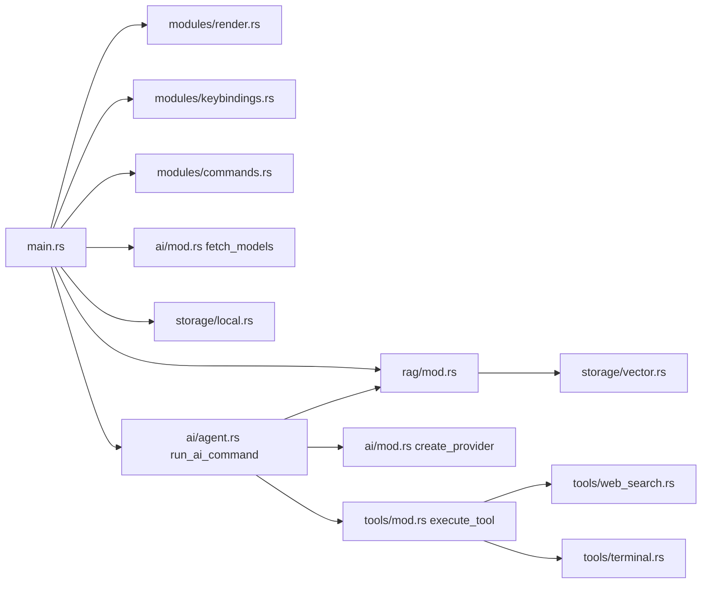

---

## 6. Key decisions (as implemented)

1. **TUI shell, not a real POSIX shell** — spawn one program + args; no parser for `|`, `>`, quotes.
2. **Human commands vs agent tools split** — agents cannot run arbitrary binaries; they get a fixed tool list.
3. **Text tool protocol** (`TOOL:` / `ARGS:`) instead of provider native tool-calling — works across Ollama and OpenAI-compatible endpoints.
4. **Sync UI + ad-hoc tokio runtimes** — avoids making the whole app async; cost is creating a Runtime per AI/settings/index action.
5. **Mouse capture only in settings** — preserves native copy/select in the output pane.
6. **Local JSON vectors instead of Qdrant** — simpler install; `qdrant-client` leftover.
7. **AI off by default** (`enabled: false`) until the user enables it in settings.
8. **All providers funneled through OpenAI-compatible HTTP** — Anthropic/Gemini use compatibility URLs, not first-party SDKs.

---

## 7. Extension points

| If you want to… | Touch |
|-----------------|--------|
| Add a keybinding | `modules/keybindings.rs` (`KeyBindings` + `get_action` + maybe `main` match) |
| Add a builtin command | `modules/commands.rs` + completions builtins list |
| Add an agent tool | `tools/terminal.rs` or new file, then `get_tool_definitions` + `execute_tool` |
| Add an AI verb | `AiCommand` in `agent.rs` + `main` routing (already uses `from_str`) |
| Change colors / prompt | `modules/config.rs` |
| Persist extra settings | `NshConfig` in `storage/local.rs` + settings pages |
| Real Qdrant | Replace `storage/vector.rs` internals; keep `add_points` / `search` signatures |
| Streaming tokens | `AiProvider::chat` + `main` loading loop (replace block_on generate) |

---

## 8. Detailed Mermaid diagrams

GitHub / most Markdown previews render these as diagrams. Node labels use file and type names from the current source.

### 8.1 System context

Who talks to nsh and over which protocol.

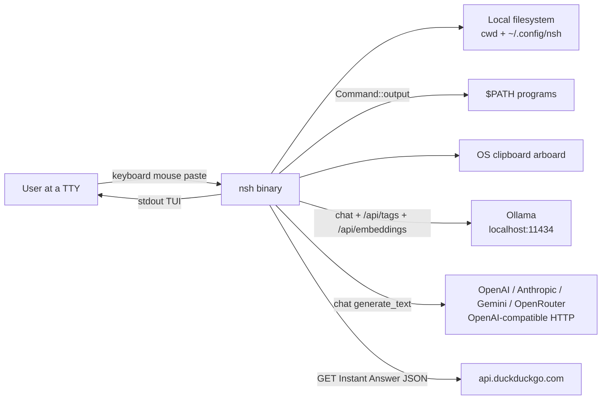

### 8.2 Crate and module map

Binary crate `nsh` links the library crate `nsh` (`src/lib.rs`).

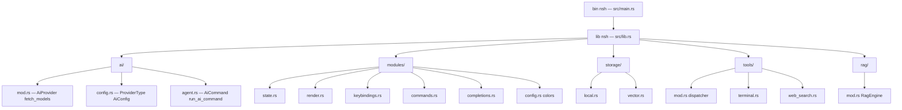

### 8.3 Main event loop (every tick)

Mouse capture is on **only** while `app.show_settings`. Alt is reconstructed from Esc+key within 25ms.

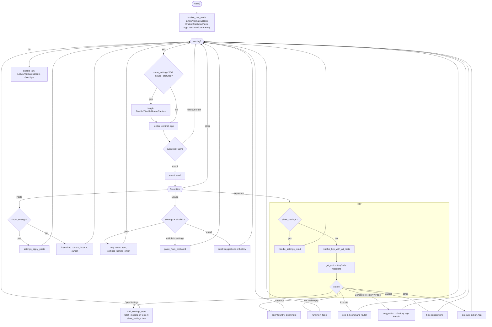

### 8.4 Enter key — command router

AI verbs are intercepted **before** `execute_command`. Sentinels `__SETTINGS__` and `__CLEAR__` are the only control codes returned by the shell path.

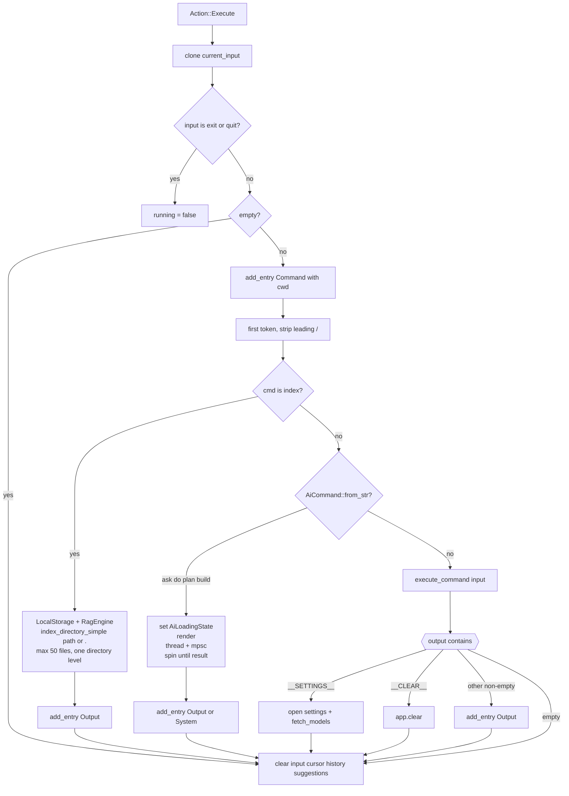

### 8.5 Human shell vs agent tools (two paths)

These are **different implementations**. Typing `ls` runs `/usr/bin/ls`. The model calling `ls` runs `tools::terminal::ls`.

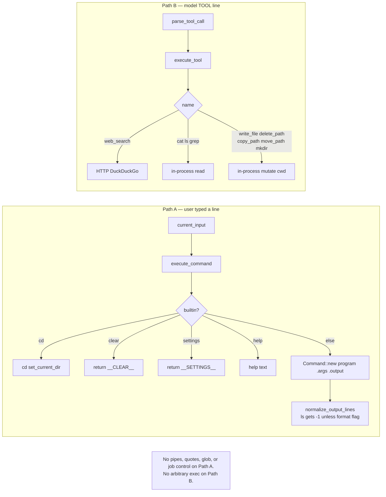

### 8.6 `execute_command` builtins and spawn

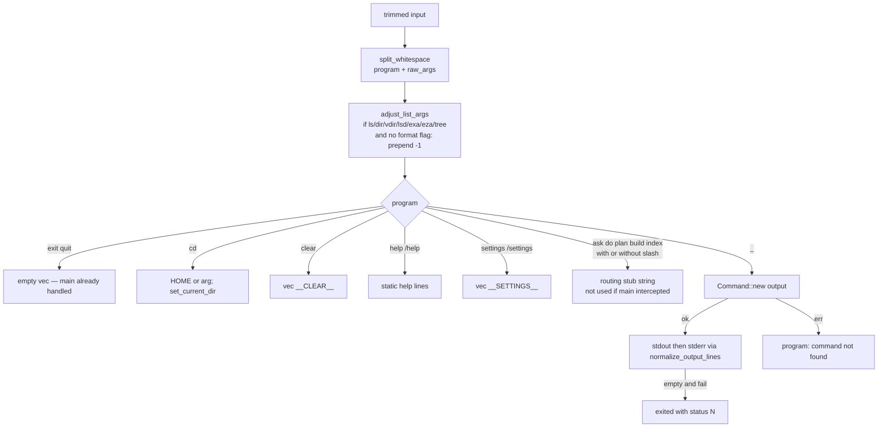

### 8.7 Completions

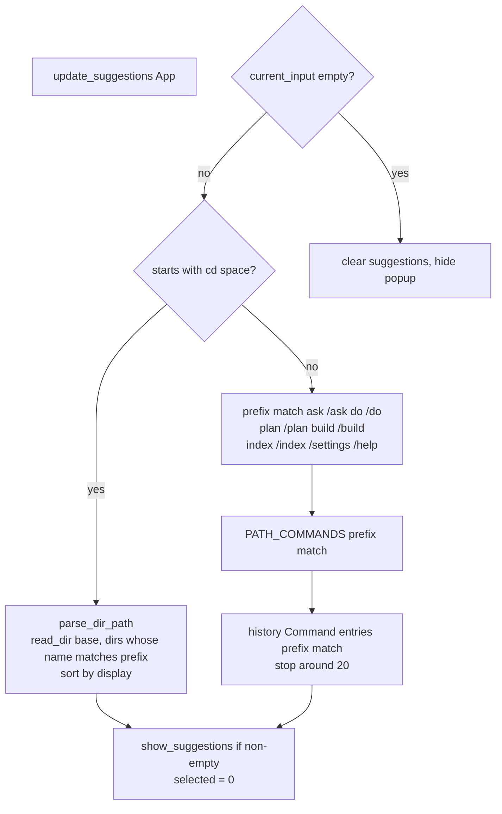

### 8.8 Agent ReAct loop (`run_ai_command`)

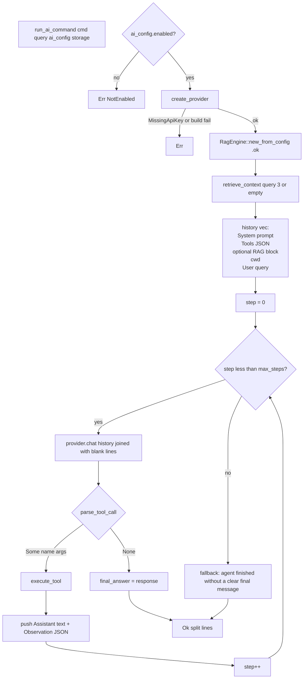

Per-verb budgets and prompts:

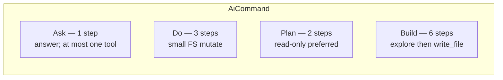

### 8.9 Tool-call parser

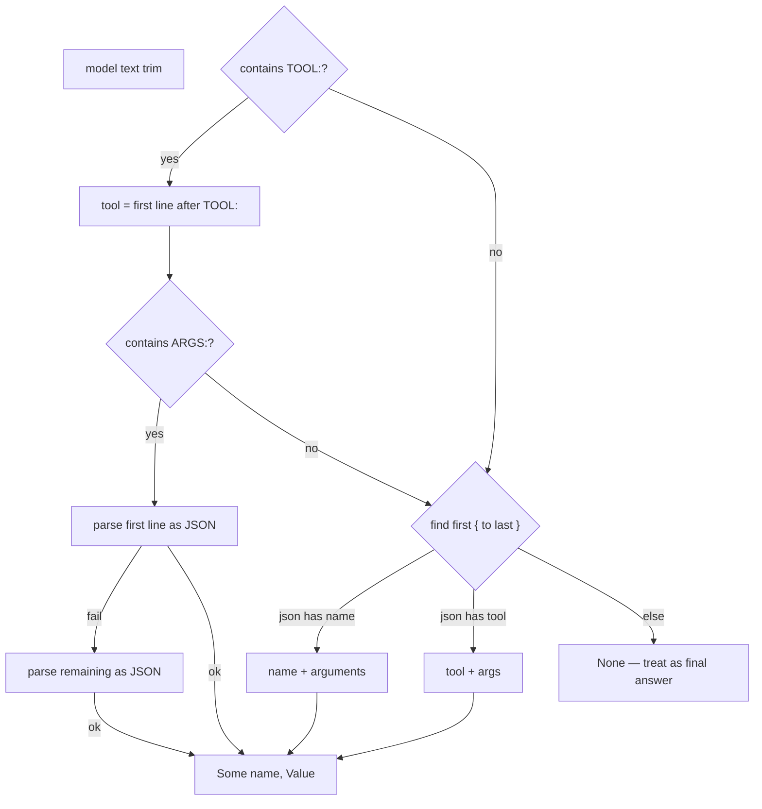

### 8.10 Tool dispatcher

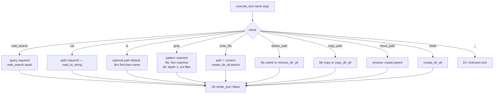

### 8.11 RAG index vs retrieve

`index` is a user command. Retrieve happens inside every AI verb (best-effort; failure is ignored).

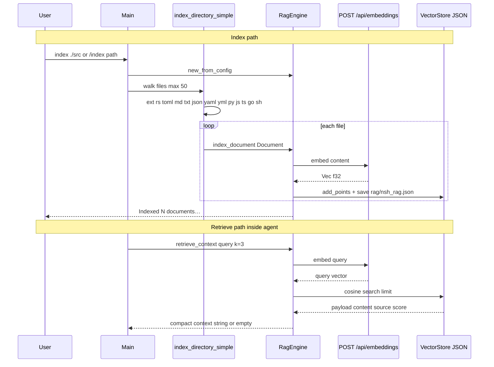

Embed URL: strip trailing `/v1` from Ollama / OpenAICompatible `base_url`; otherwise `http://localhost:11434`. Model: `ai.model` else `nomic-embed-text`. **`rag.embed_model` in config is not read.**

Vector search:

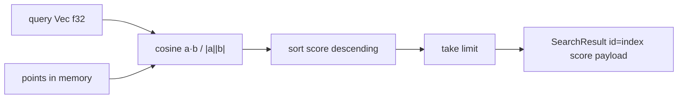

### 8.12 Settings navigation stack

`settings_nav: Vec<SettingsPage>`. Empty stack while `show_settings` means Home.

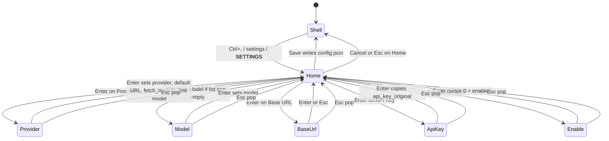

Home cursor indices:

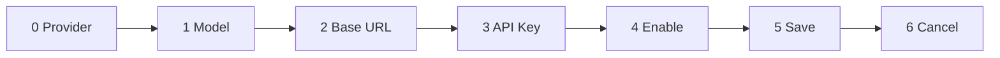

### 8.13 `App` and related types

```mermaid
classDiagram
  class App {
    +Vec~Entry~ entries
    +String current_input
    +usize cursor_position
    +usize scroll_offset
    +usize total_lines
    +Vec suggestions
    +bool show_suggestions
    +usize selected_suggestion
    +String saved_input
    +Option~usize~ history_index
    +Vec~String~ kill_ring
    +bool show_settings
    +SettingsState settings_state
    +usize settings_cursor
    +Vec~SettingsPage~ settings_nav
    +Option~AiLoadingState~ ai_loading
    +add_entry()
    +clear()
    +update_suggestions()
    +word_start_backward()
    +delete_word_before()
    +yank()
    +settings_push()
    +settings_pop()
  }

  class Entry {
    +EntryType entry_type
    +Vec~String~ content
    +String cwd
  }

  class EntryType {
    <<enumeration>>
    Command
    Output
    System
  }

  class SettingsState {
    +ProviderType provider
    +String model
    +String base_url
    +String api_key
    +String api_key_original
    +bool enabled
    +Vec~String~ available_models
  }

  class SettingsPage {
    <<enumeration>>
    Home Provider Model BaseUrl ApiKey Enable
  }

  class SettingsField {
    <<enumeration>>
    Provider Model BaseUrl ApiKey Enable Save Cancel
  }

  class AiLoadingState {
    +String verb
    +String provider
    +String model
    +usize frame
    +spinner_glyph()
    +status_line()
  }

  class AiConfig {
    +ProviderType provider
    +String model
    +String base_url
    +Option~String~ api_key
    +bool enabled
    +resolved_api_key()
    +has_usable_api_key()
  }

  class NshConfig {
    +AiConfig ai
    +RagConfig rag
  }

  App "1" --> "*" Entry
  Entry --> EntryType
  App --> SettingsState
  App --> SettingsPage
  App --> AiLoadingState
  SettingsState --> ProviderType
  NshConfig --> AiConfig
```

### 8.14 Key → Action → handler

Some actions mutate `App` in `execute_action`. Others **must** stay in `main` because they need cwd, spawn, or settings I/O.

```mermaid
flowchart LR
  subgraph keys["crossterm KeyEvent"]
    K["KeyCode + KeyModifiers"]
  end
  K --> G["get_action"]
  G --> A["Action enum"]

  subgraph main_only["Handled in main.rs"]
    A1["OpenSettings Interrupt Eof Execute"]
    A2["Complete HistoryUp HistoryDown"]
    A3["SuggestionPageUp PageDown Cancel"]
  end

  subgraph exec["execute_action"]
    E1["Move* Delete* Yank Copy Paste InsertChar"]
  end

  A --> A1
  A --> A2
  A --> A3
  A --> E1
```

### 8.15 Render pipeline

```mermaid
flowchart TD
  R["render terminal, app"]
  R --> Q{"show_settings?"}
  Q -->|yes| RS["render_settings"]
  RS --> P{"current_settings_page"}
  P -->|Home| H["render_home_page"]
  P -->|Provider| PR["render_provider_page"]
  P -->|Model| MO["render_model_page"]
  P -->|BaseUrl| BU["render_baseurl_page"]
  P -->|ApiKey| AK["render_apikey_page masked"]
  P -->|Enable| EN["render_enable_page"]

  Q -->|no| SH["render_shell"]
  SH --> LAY{"ai_loading?"}
  LAY -->|yes| L3["chunks: Min output + 1 loading + 3 input"]
  LAY -->|no| L2["chunks: Min output + 3 input"]
  L3 --> WRAP
  L2 --> WRAP["build_display_rows wrap_width"]
  WRAP --> W["wrap_line whitespace then hard wrap"]
  W --> STYLE["Command: green cwd + gray rest<br/>Output white<br/>System dark gray"]
  STYLE --> LIST["List widget scrolled"]
  LIST --> LOAD["optional yellow status bar"]
  LOAD --> INP["input Paragraph + real cursor<br/>or hidden cursor + wait hint"]
  INP --> SUG["suggestion overlay 40 cols above input"]
```

### 8.16 Provider and API key resolution

```mermaid
flowchart TD
  NEW["AiProvider::new AiConfig"]
  NEED{"provider.requires_api_key?<br/>false only for Ollama"}
  NEED -->|no| BUILD
  NEED -->|yes| USE{"has_usable_api_key?<br/>resolved length at least 8"}
  USE -->|no| MISS["Err MissingApiKey<br/>lists env vars"]
  USE -->|yes| BUILD["OpenAICompatible builder<br/>model_name, trim base_url, api_key"]

  subgraph resolve["AiConfig::resolved_api_key"]
    C{"config.api_key trim non-empty?"}
    C -->|yes| K1["use config key"]
    C -->|no| ENV["first non-empty among provider env vars"]
    ENV --> K2["OPENAI_API_KEY / ANTHROPIC_API_KEY<br/>GEMINI_API_KEY GOOGLE_API_KEY<br/>OPENROUTER_API_KEY / NSH_API_KEY"]
  end

  BUILD --> CHAT["LanguageModelRequest generate_text"]
```

Default URLs:

```mermaid
flowchart LR
  O["Ollama — http://localhost:11434"]
  OA["OpenAI — https://api.openai.com/v1"]
  AN["Anthropic — https://api.anthropic.com"]
  GE["Gemini — generativelanguage.googleapis.com/v1beta/openai/"]
  OR["OpenRouter — https://openrouter.ai/api/v1"]
  OC["OpenAI Compatible — http://localhost:11434/v1"]
```

`fetch_models`: Ollama GET `{base}/api/tags`; everyone else uses a hardcoded name list in `ai/mod.rs`.

### 8.17 Threading and runtimes

The UI thread never `.await`. Tokio exists only inside `block_on` islands.

```mermaid
flowchart TB
  subgraph ui["UI thread — sync"]
    EV["crossterm event loop"]
    RD["ratatui draw"]
    SP["spinner frame++ every ~80ms during AI"]
  end

  subgraph islands["tokio Runtime::new block_on — short lived"]
    FM["fetch_models when opening settings or changing provider"]
    IX["index_directory_simple on UI thread"]
  end

  subgraph bg["spawned OS thread per AI verb"]
    RT["its own tokio Runtime"]
    AG["run_ai_command await chat embed tools"]
    TX["mpsc::Sender Result"]
  end

  EV --> FM
  EV --> IX
  EV -->|"ask do plan build"| bg
  bg -->|"mpsc recv"| SP
  SP --> RD
```

### 8.18 On-disk layout and types

```mermaid
flowchart TB
  subgraph disk["~/.config/nsh/"]
    CJ["config.json"]
    RJ["rag/nsh_rag.json"]
  end

  CJ --> NC["NshConfig"]
  NC --> AI["AiConfig"]
  NC --> RC["RagConfig embed_model unused at runtime"]
  RJ --> PTS["Vec StoredPoint"]
  PTS --> SP["vector Vec f32<br/>payload id content source metadata"]

  LS["LocalStorage base_path = dirs::config_dir / nsh"]
  LS --> CJ
  VS["VectorStore persist_path"]
  VS --> RJ
```

### 8.19 Startup to first prompt

```mermaid
sequenceDiagram
  participant OS
  participant Main
  participant CT as crossterm
  participant App
  participant Rend as render

  OS->>Main: exec nsh
  Main->>CT: enable_raw_mode
  Main->>CT: EnterAlternateScreen EnableBracketedPaste
  Main->>App: App::new
  Main->>App: add_entry System welcome
  loop until exit/quit or Ctrl+D on empty
    Main->>Rend: draw shell or settings
    Main->>CT: poll 50ms
    CT-->>Main: Key / Paste / Mouse / timeout
    Main->>App: mutate
  end
  Main->>CT: DisableMouseCapture DisableBracketedPaste LeaveAlternateScreen
  Main->>OS: println Goodbye
```

### 8.20 Error paths the user can see

```mermaid
flowchart TD
  subgraph shell["Shell"]
    NF["program: command not found"]
    CD["cd: path: io error"]
    ST["program: exited with status N"]
  end

  subgraph ai["AI verb"]
    DIS["AI not enabled"]
    KEY["No valid API key for Provider…"]
    RT["AI error: runtime: …"]
    PR["AI error: Provider error: …"]
    EMPTY["System: verb finished empty response"]
    DISC["AI task ended unexpectedly"]
    FALL["The agent finished without a clear final message"]
  end

  subgraph rag["index"]
    INIT["RAG init failed: …"]
    ZERO["Indexed 0 documents if path missing"]
  end
```

These strings are added as `EntryType::Output` or `EntryType::System` and painted by `render_shell`.
